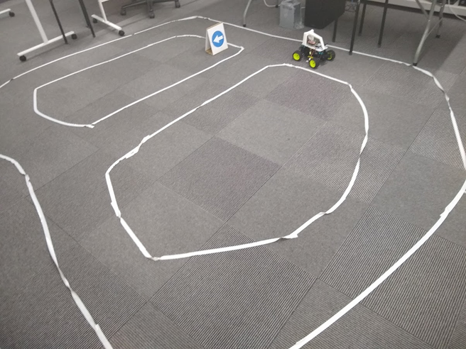
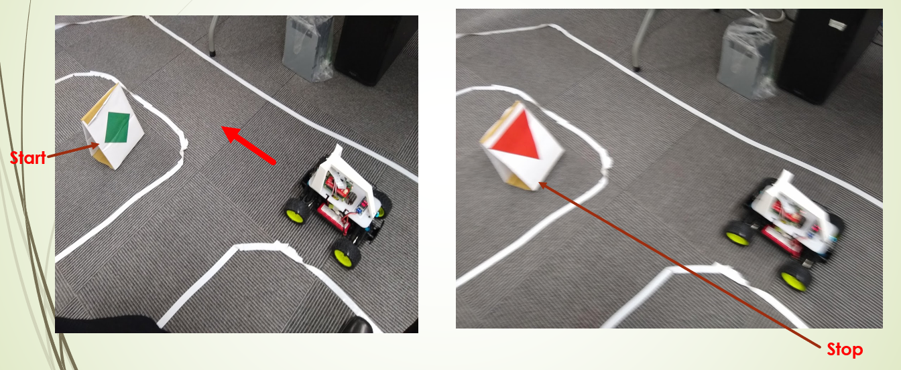
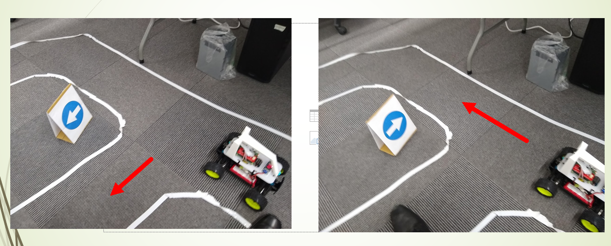

## Project Goal

In this project the goal is to use the Donkey car hardware to build a self driving car.

During this project I  had a particular focus on developing and training the Neural Network i used for navigation and integrating it with the car.

**Links;**
* [Donkey Car](https://github.com/wroscoe/donkey)

## Computer Vision

OpenCV was used to create depth maps from the stereo cameras.

## Photos

Donkey car (3d printed mount on RC car with raspberry pi)

Collecting training data on the track

Start and stop 

Track with direction

Demo

